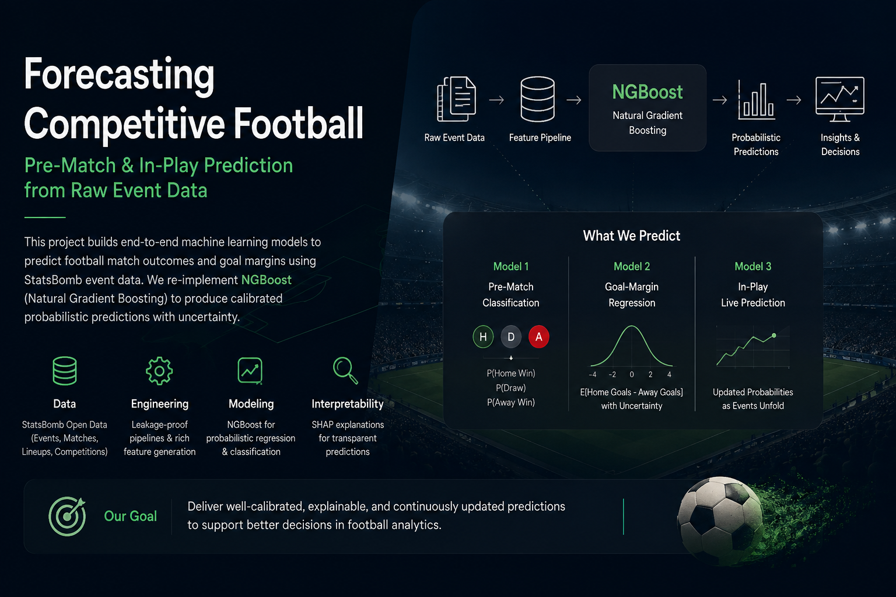

<h1 align="center">Forecasting Competitive Football</h1>

<p align="center">
  
</p>

<p align="center">
Probabilistic pre-match and in-play football forecasting with leakage-safe event pipelines, Berrar-style longitudinal representations, and Natural Gradient Boosting.
</p>

This repository contains the data-engineering, modeling, evaluation, and interpretation workflow for Premier League 2015/16. It uses a chronological holdout, validation-only model selection and calibration, an independent de-vigged bookmaker baseline, and two paper-reproduction tracks.

## Model results currently retained

The table below is the completed **general model-suite / official-library baseline run**. Rows labelled NGBoost were produced with the external `ngboost==0.5.11` library and are retained as reference baselines. They must not be reported as the required P2 project reimplementation.

| Task | Model | Evaluation | Held-out result |
|---|---|---|---:|
| Pre-match outcome (Task C) | De-vigged market | RPS | **0.1748** |
| Pre-match outcome (Task C) | Random Forest, raw | RPS | **0.1958** |
| Pre-match outcome (Task C) | Dummy, Platt calibrated | RPS | **0.2104** |
| Pre-match outcome (Task C) | Official NGBoost library, Platt | RPS | **0.2142** |
| Pre-match margin (Task R) | Kernel Ridge, Nyström | RMSE | **1.7878** |
| Pre-match margin (Task R) | Official NGBoost library | RMSE | **1.8665** |
| In-play outcome (Task L) | Official NGBoost library, raw | RPS | **0.1590** |
| In-play margin (Task L) | Gradient Boosting | RMSE | **1.4477** |
| In-play margin (Task L) | Official NGBoost library | RMSE | **1.4667** |

The required P2 results are generated separately by `code/modeling/P2_Reimplementation_Colab.ipynb`. Until that notebook completes successfully, no numerical row should be claimed for the P2 reimplementation. The P2 runner writes a direct comparison against these official-library rows after the held-out run.

## Project Scope

The system supports three forecasting settings:

| Task | Prediction time | Inputs | Outputs |
|---|---|---|---|
| Task C | Pre-match | Causal team history and frozen P1 representation | Away / Draw / Home probabilities |
| Task R | Pre-match | Same pre-match representation | Goal margin clipped to `[-5, 5]` |
| Task L | In-play | Pre-match context and event prefix available at time `t` | Updated outcome probabilities and final margin |

The general model suite includes Dummy, SVM, Random Forest, Gradient Boosting, XGBoost, LightGBM, kernel methods, and the official NGBoost library baseline where applicable. It also includes probability calibration, class-imbalance experiments, uncertainty coverage, market comparison, kernel-scaling analysis, per-minute evaluation, SHAP explanations, runtime measurement, and failure-case analysis.

## Experiment Configuration

| Item | Value |
|---|---:|
| StatsBomb target matches | 380 |
| P1-eligible matches | 374 |
| Train / validation / test matches | 251 / 77 / 46 |
| P1-eligible live snapshots | 7,854 |
| Live test snapshots | 966 |
| Pre-match features | 146 |
| In-play features | 207 |
| Selected Berrar recency | 28 matches |
| Hyperparameter candidates per family | 3 |

The pre-match representation combines 128 MD1 features with the validation-selected 18-feature Berrar home/away representation. Those 18 pre-match values remain fixed across snapshots of the same match; only leakage-safe event-prefix features evolve during play.

## Data and Representation Pipeline

StatsBomb Open Data is the primary modeling source. It supplies match metadata, labels, lineups, and event rows for Premier League 2015/16. Football-Data.co.uk is used separately for the de-vigged market benchmark and for completed historical EPL results used by the Berrar longitudinal representation. Historical Football-Data rows are not supervised target examples, and bookmaker probabilities never enter predictive feature matrices.

```text
StatsBomb events, matches, lineups       Football-Data results and odds
                 │                                   │
                 └──────────────┬────────────────────┘
                                ▼
                         Bronze / Silver
                                │
              ┌─────────────────┼─────────────────┐
              ▼                 ▼                 ▼
       MD1 pre-match       Berrar P1       Live event prefixes
              └─────────────────┼─────────────────┘
                                ▼
                              Gold
                                │
                    Task C / Task R / Task L
                                │
                                ▼
          model comparison, calibration, SHAP, uncertainty
```

## Paper Reimplementations

### P1 — Berrar et al. longitudinal representation

The P1 stage reproduces the paper's same-league longitudinal history, cross-season Super League construction, six-feature `total` representation, 18-feature `homeaway` representation, minimum-six-history rule, mean aggregation, normalized league success, and Pearson recency selection. Training-only selection froze the recency at `n = 28`.

### P2 — O'Malley et al. Natural Gradient Boosting

The **required P2 path is the project reimplementation**, not the historical PyPI NGBoost notebook. Its canonical workflow is:

```text
code/modeling/p2_source/                     # visible canonical implementation
code/modeling/ngboost/__init__.py            # repository-local import facade
code/modeling/p2_source_manifest_sha256.json # normalized source-integrity record
code/modeling/P2_Reimplementation_Colab.ipynb
code/modeling/prepare_p2_reimplementation.py
code/modeling/run_p2_reimplementation_final.py
code/modeling/requirements_colab_p2_reimplementation.txt
```

The preparation step verifies all 28 committed Python files directly from `code/modeling/p2_source/` against the SHA-256 manifest after normalizing text line endings to LF, so the same reviewed source verifies on Linux/Colab and Windows CRLF checkouts. It compiles the source and confirms that imports resolve through the repository-local `ngboost` facade. No source archive is unpacked, reconstructed, or rewritten, and the P2 environment does not install the external PyPI `ngboost` package.

The P2 evaluator covers categorical Task C, Normal Task R, live Task L, and the paper-faithful conditional bivariate Gaussian experiment over home/away goals. It generates raw/calibrated reliability evidence, row-level predictions, ten-worst cases, frozen pre-match live baselines, metric-vs-minute and per-phase tables, predictive-interval coverage, multivariate covariance diagnostics, sampled peak RSS, prediction latency, and a comparison with the separately labelled official-library baseline.

See `code/modeling/P2_REIMPLEMENTATION_PATCHES.md` for the exact integration changes and `code/modeling/P2_REIMPLEMENTATION_STATUS.md` for what still requires a successful full execution.

## Leakage and Evaluation Controls

- All data splits are chronological and match-level.
- Every snapshot from a match remains in the same partition.
- Historical matches must finish strictly before the target kickoff.
- Live features use only events available at or before each snapshot cutoff.
- Imputers, model selection, calibration, and uncertainty scaling use training or validation data only.
- Test labels do not select the P1 recency, representation, model configuration, or calibrator.
- Market probabilities remain outside all feature matrices.
- The P2 feature contract is reconstructed from the data-pipeline audit plus the frozen P1 schema, not from the historical NGBoost model-output configuration.

## Artifacts

### Required P2 reimplementation

- [P2 Colab notebook](code/modeling/P2_Reimplementation_Colab.ipynb)
- [Visible P2 source](code/modeling/p2_source/)
- [Verified source preparation](code/modeling/prepare_p2_reimplementation.py)
- [P2 evaluation entry point](code/modeling/run_p2_reimplementation_final.py)
- [P2 mathematical/API tests](code/modeling/test_p2_reimplementation.py)
- [P2 integration patch record](code/modeling/P2_REIMPLEMENTATION_PATCHES.md)
- [P2 status](code/modeling/P2_REIMPLEMENTATION_STATUS.md)
- [Appendix A derivation](code/modeling/P2_APPENDIX_A_DERIVATION.md)

A successful full run creates `code/modeling/outputs/p2_reimplementation_full/`. Those generated files—not the historical library outputs—are the evidence source for P2 report Sections 4.2, 4.2.1 and 6.5.

### Historical official-library baseline

- `code/modeling/Football_Forecasting_NGBoost_Colab.ipynb`
- `code/modeling/outputs/ngboost_p1_corrected_full/`
- `code/modeling/outputs/ngboost_p1_corrected_full_evidence.zip`

These artifacts remain useful for the general model comparison and for direct P2-vs-library evaluation, but are not the P2 reimplementation.

## Reproduction

For the required P2 reproduction, open `code/modeling/P2_Reimplementation_Colab.ipynb` in Colab and run all cells. The notebook resolves both `/content/drive/MyDrive/ml_project` and `/content/drive/MyDrive/ML-Project-Football-Forecasting` in addition to a standard Colab checkout.

For local CPU execution, follow `code/modeling/README.md`.

## Repository Structure

```text
.
├── assets/
├── code/
│   ├── data_pipeline/
│   │   └── results/
│   └── modeling/
│       ├── p2_source/
│       ├── ngboost/
│       ├── P2_Reimplementation_Colab.ipynb
│       ├── prepare_p2_reimplementation.py
│       ├── run_p2_reimplementation_final.py
│       ├── test_p2_reimplementation.py
│       ├── P2_APPENDIX_A_DERIVATION.md
│       ├── Football_Forecasting_NGBoost_Colab.ipynb   # official-library baseline
│       └── outputs/
└── README.md
```

## References

- Berrar, D., Lopes, P., & Dubitzky, W. (2024). *A data- and knowledge-driven framework for developing machine learning models to predict soccer match outcomes*. Machine Learning, 113, 8165–8204. DOI: 10.1007/s10994-024-06625-9.
- O'Malley, M., Sykulski, A. M., Lumpkin, R., & Schuler, A. (2023). *Probabilistic Prediction of Oceanographic Velocities with Multivariate Gaussian Natural Gradient Boosting*. Environmental Data Science, 2, e10. DOI: 10.1017/eds.2023.4.
- StatsBomb Open Data.
- Football-Data.co.uk.
